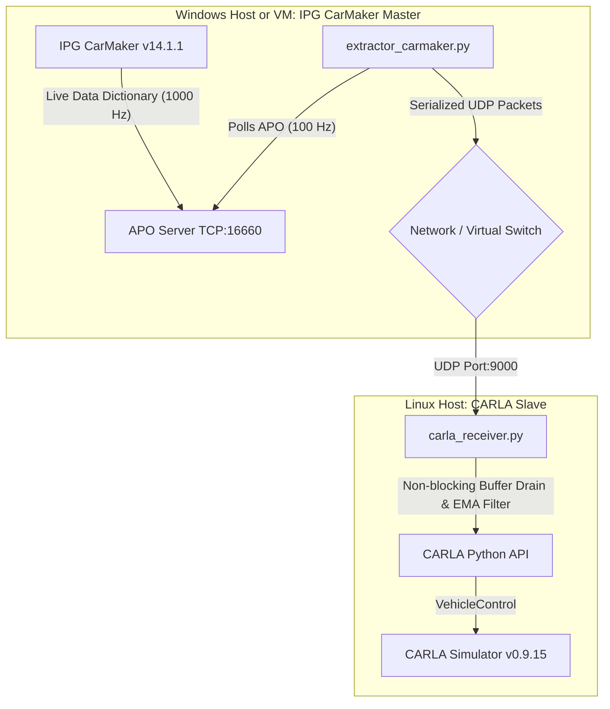

# Asynchronous SIL/HIL Simulation Bridge: IPG CarMaker ↔ CARLA Simulator

This repository contains a high-performance, Software-in-the-Loop (SIL) and Hardware-in-the-Loop (HIL) asynchronous simulation bridge. It is designed to inject high-fidelity vehicle dynamics and driver control inputs from an **IPG CarMaker** instance (running on Windows) into a **CARLA Simulator** instance (running on Linux). 

---

## 1. Project Overview

In autonomous driving and vehicle dynamics validation, co-simulation combines the strengths of multiple platforms:
* **IPG CarMaker** provides industry-standard vehicle physics, detailed powertrain/chassis models, and hardware-in-the-loop (HIL) input hub interfaces (e.g., physical steering wheels and pedals).
* **CARLA Simulator** acts as the high-fidelity virtual sensor environment, managing camera/lidar rendering, traffic actors, and active physics.

This bridge enables a low-latency, event-driven, time-compensated channel using UDP, allowing real-time injection of inputs with minimal phase lag, eliminating Unreal Engine physics freezes, and managing network jitter.

---

## 2. System Architecture

The bridge utilizes an asynchronous master/slave architecture separated across OS boundaries:



### Architectural Key Elements:
* **Master / Sender (Windows Host or VM)**:
  * Runs **IPG CarMaker v14.1.1**.
  * Exposes simulation variables via the CarMaker **APO (Application Programming Interface for Online Data Access)** server on TCP port `16660`.
  * The `extractor_carmaker.py` script connects to the APO server, extracts steering, gas, and brake inputs, and packages them into high-frequency UDP frames.
* **Slave / Receiver (Linux Host)**:
  * Runs **CARLA 0.9.15** on Linux.
  * The `carla_receiver.py` script listens on UDP port `9000` inside a non-blocking socket loop.
  * **Exponential Moving Average (EMA) Filtering**: To handle network phase lag and prevent input jitter from affecting vehicle stability, pedal inputs are smoothed using an EMA filter with an $\alpha$ factor dynamically compensated for the actual elapsed time ($dt$) between packets.
  * **Aggressive Buffer Draining**: The receiver continuously flushes the UDP socket buffer at every iteration to consume only the newest packet, dropping obsolete frames and preventing control lag.

---

## 3. Prerequisites & Environment Constraints

### Linux Host (Tested on CachyOS / Arch Linux)
> [!IMPORTANT]
> CARLA 0.9.15 precompiled Python wheels only support Python 3.7 (`cp37-cp37m`). Attempting to run the bridge on modern system Python versions (e.g., Python 3.11+) will fail with a wheel incompatibility error (`is not a supported wheel on this platform`). You **must** configure a dedicated Python 3.7 environment.

1. **Install Python 3.7** (using `pyenv`, system package managers, or compiling from source).
2. **Set up a Virtual Environment**:
   ```bash
   # Create a virtual environment using Python 3.7
   python3.7 -m venv venv_carla
   
   # Activate the environment
   source venv_carla/bin/activate
   
   # Upgrade basic tools
   pip install --upgrade pip setuptools wheel
   ```
3. **Install CARLA Python API Client**:
   Ensure you install the `.whl` corresponding to CARLA 0.9.15 and Python 3.7.
   ```bash
   pip install carla==0.9.15
   ```

### Windows Host / VM
* **IPG CarMaker**: Version 14.1.1 (recommended).
* **Python**: Python 3.x (to run the extractor).
* **Network Connection**: Direct LAN or Virtual Network interface linking the Windows machine/VM to the Linux host.

---

## 4. Configuration Steps

### Network Setup
1. **IP Binding & Ping Verification**:
   Verify network connectivity between the Windows sender and Linux receiver:
   ```cmd
   # From Windows Host/VM
   ping <LINUX_IP_ADDRESS>
   ```
2. **Firewall Permissions**:
   * On the Linux host, ensure port `9000/udp` is open.
   * On Windows Defender Firewall, either disable the firewall temporarily for private networks or add an explicit **Inbound/Outbound Rule** allowing UDP traffic on port `9000`.
3. **Socket Binding**:
   Verify that `carla_receiver.py` is configured to bind to `0.0.0.0` (or the specific static IP of your Linux network card) to receive external packages.

### CarMaker Application Configuration
1. **APO Command Line Option**:
   To expose the simulation variables via TCP, you must run the CarMaker executable with the command-line flag `-cmdport 16660`.
   * Open CarMaker, go to **App > Command Line Options** and add:
     ```text
     -cmdport 16660
     ```
   * If connecting to a physical setup (e.g., **SensoWheel** steering wheel system), append the hardware configuration flags alongside the port:
     ```text
     -io can -cmdport 16660
     ```
2. **Data Dictionary / UAQ Mapping Shifts**:
   Depending on whether you are running in virtual-only SIL mode or HIL mode with physical steering and pedal rigs, you must map the corresponding User-Accessible Quantities (UAQs) in the CarMaker data dictionary:
   * **Virtual SIL Mode**:
     * Steering Angle: `DM.Steer.Ang` (Driver Model Steering Angle)
     * Gas Pedal: `DM.Gas`
     * Brake Pedal: `DM.Brake`
   * **Hybrid/Hardware HIL Mode**:
     * Steering Wheel Angle: `Senso.Ang` (SensoWheel physical angle) or `Qu.Steer`
     * Pedal Inputs: `Qu.Gas` / `Qu.Brake`

---

## 5. Strict Execution Sequence

To prevent **Real-time Violations** and CPU starvation, you must adhere strictly to the following execution sequence.

> [!WARNING]
> Running the Windows extractor script before the CarMaker simulation has fully initialized and stabilized will trigger a `Main cycle too long` Fatal Error on CarMaker due to APO polling collision during startup.

1. **Step 1: Start CARLA Simulator (Linux)**
   Launch the CARLA server on the Linux machine:
   ```bash
   ./CarlaUE4.sh -opengl
   ```
2. **Step 2: Start Carla Receiver (Linux)**
   Activate the Python 3.7 virtual environment and run the receiver. It will block and await incoming UDP telemetry:
   ```bash
   source venv_carla/bin/activate
   python carla_receiver.py
   ```
3. **Step 3: Launch CarMaker Simulation (Windows)**
   * Load your TestRun in CarMaker.
   * Click **Start** to run the simulation.
   * **Wait exactly 3 seconds** to let the physical/virtual CAN cycle stabilize at 1000 Hz.
4. **Step 4: Start Extractor (Windows)**
   Run the extractor script to begin polling the APO server and forwarding packets to CARLA:
   ```cmd
   python extractor_carmaker.py --target-ip <LINUX_IP_ADDRESS>
   ```

---

## 6. Troubleshooting Matrix

| Issue / Error | Root Cause | Mitigation / Solution |
| :--- | :--- | :--- |
| **`APO Timeout (10.0s)`** | 1. CarMaker is not running.<br>2. Zombie backend processes blocking port `16660`.<br>3. Missing `-cmdport 16660` startup argument. | 1. Ensure CarMaker is open and a TestRun is loaded.<br>2. Run `taskkill /F /IM CarMaker.win64.exe` to kill zombie instances.<br>3. Verify the command line options inside CarMaker. |
| **`Main cycle too long`** / **`Realtime conditions violated`** | 1. Extractor executed before simulation stabilization.<br>2. APO polling rate is too high (e.g., > 200 Hz). | 1. Implement a 3-second delay after clicking Start in CarMaker before running `extractor_carmaker.py`.<br>2. Verify the polling rate in `extractor_carmaker.py` is throttled to 100 Hz. |
| **`CARLA Vehicle Frozen`** *(No UDP traffic)* | 1. Windows Defender Firewall blocking port `9000/udp`.<br>2. Incorrect target IP argument in `extractor_carmaker.py`. | 1. Add inbound firewall rules on both hosts for `UDP port 9000`.<br>2. Verify you can ping the Linux host from the Windows host.<br>3. Verify the IP parameter passed to the extractor. |
| **`ModuleNotFoundError: No module named 'carla'`** | 1. Python virtual environment not active.<br>2. Unsupported Python version (e.g., system Python 3.11+). | 1. Run `source venv_carla/bin/activate` before starting the receiver.<br>2. Verify `python --version` outputs Python 3.7. |
